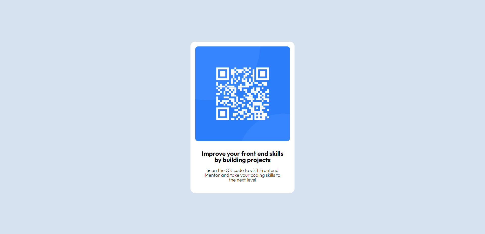
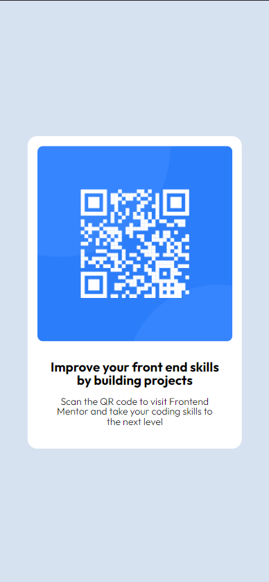

# QR code landing page

## Table of contents

-   [Overview](#overview)
    -   [Screenshot](#screenshot)
-   [Author](#author)

**Note: Delete this note and update the table of contents based on what sections you keep.**

## Overview

This is a solution to the [QR code component challenge on Frontend Mentor]

### Screenshot

|          Desktop view          |          Mobile view          |
| :----------------------------: | :---------------------------: |
|  |  |

**Note: Delete this note and the paragraphs above when you add your screenshot. If you prefer not to add a screenshot, feel free to remove this entire section.**

### Links

-   Solution URL: [Add solution URL here](https://your-solution-url.com)
-   Live Site URL: [Add live site URL here](https://your-live-site-url.com)

## Author

-   Linkedin - [Lucas Almeida](https://www.linkedin.com/in/almeida-lucas1/)
-   Frontend Mentor - [@me-luc](https://www.frontendmentor.io/profile/me-luc)

**Note: Delete this note and add/remove/edit lines above based on what links you'd like to share.**
